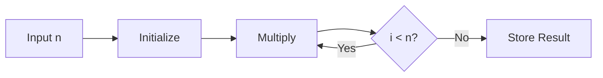
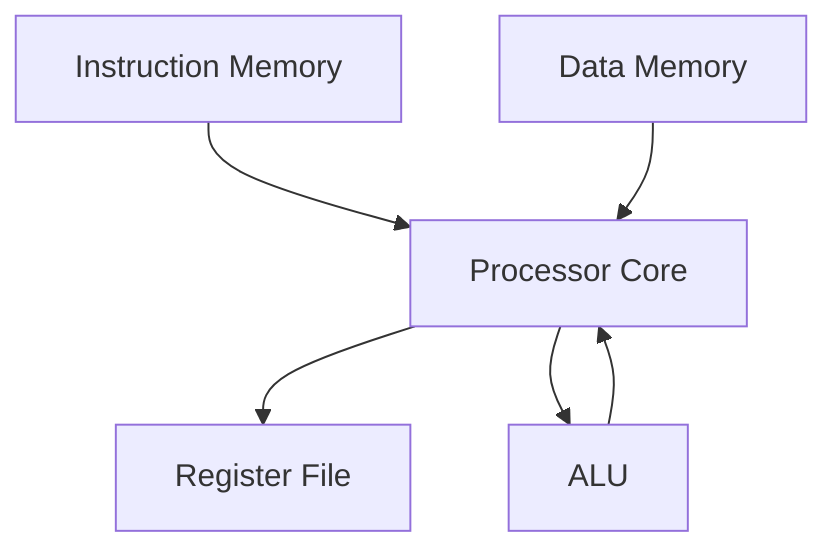

# 🖥️ MIPS Processor Implementation

> A non-pipelined MIPS processor implementation in Python with example programs demonstrating core MIPS architecture concepts.

## 🌟 Overview

This project implements a MIPS processor simulator that executes common MIPS assembly instructions. It includes example programs demonstrating practical applications and core architectural concepts.

## 🎯 Featured Programs

### 1. Factorial Calculator

- 🔄 Iterative implementation
- 💾 Memory-efficient register usage
- 🔢 Handles positive integers up to n=10

### 2. Binary Search Implementation
```mermaid
flowchart TD
    A[Start] --> B[Initialize bounds]
    B --> C[Calculate mid]
    C --> D{Found?}
    D -->|Yes| E[Return index]
    D -->|No| F{arr[mid] > key?}
    F -->|Yes| G[Update upper bound]
    F -->|No| H[Update lower bound]
    G --> C
    H --> C
    D -->|Bounds crossed| I[Return -1]
```
- 📊 Works with sorted arrays
- 🔍 Efficient searching algorithm
- 📝 Returns index or -1 if not found

## 🛠️ Technical Architecture



## 📁 Project Structure

```
MIPS_Project/
├── 📜 Processor.py          # Main processor implementation
├── 📄 assembler.py          # MIPS assembly to machine code
├── 📝 AssemblyCode_*.asm    # Example programs
└── 📚 Documentation/
    └── 📊 Report.pdf        # Design & analysis
```

## ⚙️ Features

- ✨ Complete instruction cycle simulation (Fetch → Decode → Execute → Memory → Writeback)
- 🔧 Support for R-format, I-format, and J-format instructions
- 💾 Configurable memory and register file
- 🔍 Step-by-step execution monitoring
- 📊 Memory state visualization

## 🚀 Getting Started

1. **Setup Requirements**
   ```bash
   python 3.x
   ```

2. **Run the Simulator**
   ```bash
   python Processor.py
   ```

3. **Test Assembly Programs**
   - Use MARS MIPS simulator for assembly code verification
   - Load `.asm` files and execute

## 🎮 Usage Example

```python
# Load and execute factorial program
python Processor.py
# View memory contents at 0x10010000 for result
```

## 🔬 Instruction Support

| Category | Instructions |
|----------|-------------|
| Arithmetic | `add`, `sub`, `addi`, `mul` |
| Logical | `and`, `or`, `ori` |
| Data Transfer | `lw`, `sw`, `lui` |
| Control Flow | `beq`, `bne`, `j` |
| Shift Ops | `sll`, `srl` |

## 📈 Performance Metrics

- Single-cycle execution
- Predictable instruction timing
- No pipeline hazards

## 👥 Contributing

Feel free to fork, enhance, and submit pull requests. Areas for improvement:
- Pipeline implementation
- More test programs
- Extended instruction support

## 📝 License

MIT License - feel free to use and modify for educational purposes.